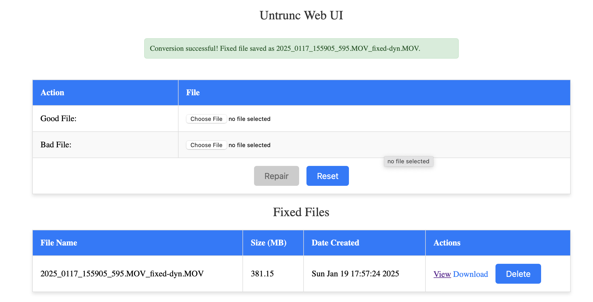
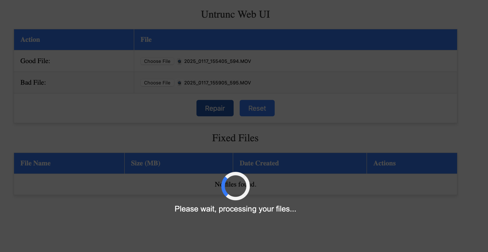
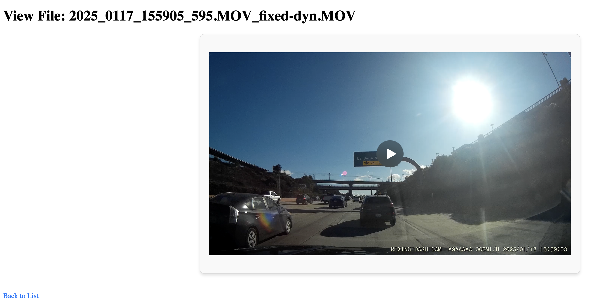

Untrunc Web
=======

Provides a UI for the untrunc app which will restore a damaged (truncated) mp4, m4v, mov, 3gp video. Provided you have a similar not broken video. And some luck.

You need:

    * Broken video file
    * Another video file which isn't broken

#### Frontend




#### Viewer



## Local Development

Install untrunc locally
```
cd ~/workspace
git clone https://github.com/anthwlock/untrunc.git
cd untrunc
brew install wget
make FF_VER=6.0.1
sudo cp untrunc /usr/local/bin
```

## Building

```
docker compose build
```

##
```
http://localhost:5001
```


## Donation
If you like this webui front end and want to contribute to my [coffee fund](https://www.paypal.com/paypalme/viperz28).

If this software (untrunc) helped you please consider donating [here](https://www.paypal.me/anthwlock)!\
Donations will encourage me to keep working on this software, leading to more media being supported and better recovered files.

You might also want to consider donating to **ponchio**, see his instructions [here](https://github.com/ponchio/untrunc#helpsupport).

Thank you.
